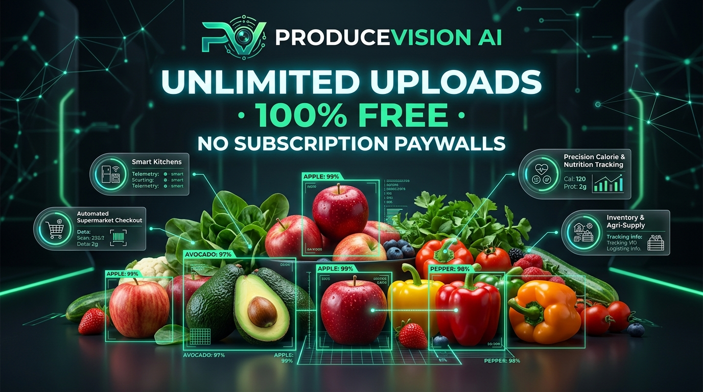

# 🥝 ProduceVision Studio Pro — Enterprise Guide & Detection Manual



> **Enterprise Computer Vision for Fresh Produce, Nutrition Intelligence, and Subject Awareness.**  
> *100% Free · Unlimited Scans · Zero Subscription Paywalls · Privacy-First*

---

## 📑 Table of Contents
1. [Executive Overview & The Competitive MOAT](#1-executive-overview--the-competitive-moat)
2. [Complete System Features & Capabilities](#2-complete-system-features--capabilities)
3. [Deep Dive: Detection Parameters & Tuning Science](#3-deep-dive-detection-parameters--tuning-science)
   - [Detection Presets (Consensus vs. High Sensitivity)](#detection-presets)
   - [What is Confidence Threshold?](#what-is-confidence-threshold)
   - [What is IoU NMS (Non-Maximum Suppression)?](#what-is-iou-nms-non-maximum-suppression)
   - [Parameter Scenario Matrix & Cheat-Sheet](#parameter-scenario-matrix--cheat-sheet)
4. [The MOAT: Unlimited Free Uploads vs. Proprietary AI](#4-the-moat-unlimited-free-uploads-vs-proprietary-ai)
5. [Real-World Applications & Industry Deployments](#5-real-world-applications--industry-deployments)
6. [Hardware & Privacy Architecture](#6-hardware--privacy-architecture)
7. [API & Quickstart Integration](#7-api--quickstart-integration)

---

## 1. Executive Overview & The Competitive MOAT

Modern AI vision systems for agriculture, kitchens, and retail are notoriously locked behind restrictive paywalls, restrictive API credit limits, and subscription tiers. 

**ProduceVision Studio Pro** delivers a full-stack, enterprise-grade produce intelligence system powered by a dedicated **YOLOv8m 63-class produce localization backbone**, cross-verified with a **Vision Transformer (ViT) Consensus Engine**, and enriched with a verified **USDA nutritional database**.

### 🌟 The Core MOAT: Unlimited Uploads & Free Accessibility
Unlike mainstream AI platforms that rate-limit image uploads or charge per-scan fees, ProduceVision Studio Pro provides:
* **Zero Upload Limits**: Scan 1 photo or 10,000 photos per day without rate limits, daily caps, or throttles.
* **Zero Subscription Paywalls**: Complete access to real-time bounding boxes, ViT consensus scoring, USDA nutritional metrics, recipe synthesis, and exportable inventory checklists with no monthly fee.
* **Hardware-Accelerated Privacy**: Camera streams run exclusively on the client device. When an image is snapped, the camera hardware track is immediately powered off to protect privacy and save device battery.

---

## 2. Complete System Features & Capabilities

```
┌────────────────────────────────────────────────────────────────────────┐
│                        PRODUCEVISION PIPELINE                          │
├──────────────────┬───────────────────────┬─────────────────────────────┤
│   Input Studio   │     Neural Engine     │      Output Analytics       │
├──────────────────┼───────────────────────┼─────────────────────────────┤
│ • 4K Live Camera │ • YOLOv8m (63 classes)│ • Bounding Box Canvas       │
│ • Pinch-to-Zoom  │ • ViT Consensus Layer │ • Subject Breakdown (Counts)│
│ • 90° Rotations  │ • COCO Special Filter │ • USDA Nutritional Metrics  │
│ • H/V Mirroring  │   (Humans, Cats, Dogs)│ • Culinary Chef Recipes     │
│ • File Upload    │ • Non-Max Suppression │ • Inventory Text Checklist  │
└──────────────────┴───────────────────────┴─────────────────────────────┘
```

### 1. 63+ Produce Classes + Human & Pet Awareness
* **Vegetables & Greens**: Potatoes, Sweet Potatoes, Pumpkins, Onions, Spring Onions, Broccoli, Carrots, Corn, Cucumbers, Garlic, Bell Peppers, Eggplants, Lettuce, Mushrooms, Beetroots, Spinach, Cauliflower, Cabbage, Ginger, Chili, Peas, Radishes, Turnips, Zucchini, Green Beans, Asparagus, Celery, Artichokes.
* **Fruits & Berries**: Apples, Bananas, Oranges, Mandarins, Clementines, Grapes, Strawberries, Watermelons, Mangoes, Pineapples, Pears, Peaches, Cherries, Lemons, Limes, Avocados, Tomatoes, Coconuts, Kiwi, Melons, Cantaloupes, Pomegranates, Blueberries, Blackberries, Raspberries, Papayas, Figs, Dates, Apricots.
* **Human & Animal Filtering**: Automatically identifies humans (faces/persons) and pets (cats, dogs, cows, horses) to ensure accidental subjects in frame do not contaminate produce nutritional calculations.

### 2. Live Camera Studio with WYSIWYG Client Controls
* **Real-Time Transformations**: Instant 90° clockwise rotation, horizontal mirror (Flip H), and vertical flip (Flip V) directly in the viewfinder.
* **Hardware Pinch-to-Zoom (1.0x to 5.0x)**: Full mobile multi-touch pinch gesture zoom, double-tap zoom toggle, and quick-zoom selector pills (1x, 1.5x, 2x, 3x, 5x).
* **Mobile-Optimized Interface**:
  * Side-by-side compact tabs: `📸 Live Cam` and `📁 Upload`.
  * Automatic smooth scrolling directly into the results panel (`#output-col`) when a picture is captured or uploaded.
  * Pinned top-right `● CAMERA ACTIVE` green privacy indicator fixed to the viewport during page scrolling.
  * Instant hardware stream termination on photo capture to preserve battery and guarantee privacy.
  * Smart button locking during inference (`⏳ Analyzing Produce with AI...`) and warning toast if clicked while the camera is off.

### 3. Comprehensive USDA Nutritional Intelligence
Every detected produce item is cross-referenced against standardized USDA edible portion metrics (per 100g):
* **Macronutrients**: Calories (kcal), Carbohydrates (g), Protein (g), Dietary Fiber (g), Total Sugars (g).
* **Micronutrients & Vitamins**: Vitamin A, Vitamin C, Potassium, Lycopene, Beta-carotene, Inulin, and Allicin.
* **Evidence-Based Health Benefits**: Cardioprotective lipids, glycemic load dynamics, and cellular hydration properties.

### 4. Culinary Chef Engine & Inventory Checklist
* Generates chef-curated recipe ideas tailored specifically to the fruits and vegetables found in the scan.
* Produces an exportable inventory checklist ready to copy into shopping apps or inventory spreadsheets.

---

## 3. Deep Dive: Detection Parameters & Tuning Science

ProduceVision provides fine-grained controls to tailor the computer vision model to diverse lighting environments, packing densities, and camera angles.

```
                           [ INPUT IMAGE ]
                                  │
                                  ▼
               ┌──────────────────────────────────────┐
               │         YOLOv8m Inference            │
               │   Generates Raw Bounding Boxes (B)   │
               └──────────────────┬───────────────────┘
                                  │
                                  ▼
                     [ CONFIDENCE THRESHOLD ]
           Filters out any box where Confidence < Threshold
                                  │
                                  ▼
                    [ NON-MAXIMUM SUPPRESSION ]
              Removes duplicate boxes where IoU > Threshold
                                  │
                                  ▼
                     [ ViT CONSENSUS ENGINE ]
                 (If Consensus Mode is enabled)
             Validates crop against Vision Transformer
                                  │
                                  ▼
                       [ FINAL DETECTIONS ]
```

---

### Detection Presets

#### 🎯 Consensus Mode (Ultra-Precision)
* **How It Works**: Operates as a dual-model voting pipeline. Candidate detections generated by YOLOv8m are cropped and passed through an auxiliary Vision Transformer classifier. If both models agree on the produce family, the detection is confirmed.
* **Best Used For**: High-stakes dietary tracking, culinary inventory, single-produce classification, and clean kitchen countertops where false positives are unacceptable.
* **Default Settings**: Confidence: `0.30`, IoU NMS: `0.40`.

#### ⚡ High Sensitivity (Crowded Basket)
* **How It Works**: Bypasses secondary consensus filtering and lowers internal acceptance gates, prioritizing maximum recall.
* **Best Used For**: Crowded fruit bowls, bulk grocery baskets, occluded or partially buried items, and low-light agricultural crates.
* **Default Settings**: Confidence: `0.20`, IoU NMS: `0.45`.

---

### What is Confidence Threshold?

#### Definition
The **Confidence Threshold** ($C$) is the minimum probability score (ranging from $0.0$ to $1.0$) that the neural network must assign to a detected bounding box for it to be accepted.

$$\text{Confidence} = P(\text{Object}) \times P(\text{Class} \mid \text{Object})$$

* $P(\text{Object})$: Probability that a physical object exists within the bounding box.
* $P(\text{Class} \mid \text{Object})$: Probability that the object belongs to a specific class (e.g., *Avocado*).

#### Tuning Dynamics: Precision vs. Recall
* **Low Confidence ($0.10 - 0.25$) — High Recall**:
  * *Effect*: Catches nearly every produce item, including distant, blurry, or partially hidden fruits.
  * *Trade-off*: May occasionally misidentify shadows, textures, or packaging as produce.
  * *When to use*: Dense farmers' market crates, occluded grocery bags, dimly lit rooms.
* **Balanced Confidence ($0.30 - 0.45$) — Optimal Benchmark**:
  * *Effect*: Balances high accuracy with strong detection coverage. Filters background noise while detecting standard produce reliably.
  * *When to use*: General-purpose kitchen scans, standard meal photography, mobile camera snapshots.
* **High Confidence ($0.50 - 0.90$) — High Precision**:
  * *Effect*: Strictly accepts bounding boxes where the model is overwhelmingly certain.
  * *Trade-off*: Smaller, angled, or partially eaten fruits might be ignored.
  * *When to use*: Commercial product photography, automated supermarket checkout conveyors, clean studio setups.

---

### What is IoU NMS (Non-Maximum Suppression)?

#### Definition
**Intersection over Union (IoU)** is the geometric metric that measures how much two predicted bounding boxes overlap relative to their combined area:

$$\text{IoU} = \frac{\text{Area of Overlap}}{\text{Area of Union}} = \frac{|B_1 \cap B_2|}{|B_1 \cup B_2|}$$

During detection, convolutional feature maps often propose multiple candidate boxes for a single apple or carrot. **Non-Maximum Suppression (NMS)** is the clustering algorithm responsible for removing redundant duplicates.

```
       Box 1 (Score: 0.94)
    ┌──────────────────────┐
    │  ╔════════════════╗  │
    │  ║ Area of        ║  │    IoU = Area of Overlap / Area of Union
    │  ║ Overlap (∩)    ║  │
    │  ╚════════════════╝  │
    └──────────────────────┘
         Box 2 (Score: 0.78)
```

#### How NMS Works:
1. All candidate boxes for a given class are sorted descending by their confidence score.
2. The box with the highest score is retained as the "master" box.
3. The IoU overlap between this master box and all other candidate boxes is calculated.
4. If the IoU exceeds the set **IoU NMS Overlap Threshold**, the secondary box is considered a duplicate and suppressed (discarded).
5. The process repeats iteratively until all candidate boxes have been evaluated.

#### Tuning Dynamics:
* **Low IoU NMS ($0.10 - 0.25$) — Strict Suppression**:
  * *Effect*: Highly aggressive deduplication. Prohibits any boxes from even slightly overlapping.
  * *Risk*: In a cluster of closely packed items (e.g., a bunch of bananas or a bowl of cherries), legitimate neighboring fruits will suppress each other.
  * *When to use*: Isolated fruits spread far apart on a flat counter.
* **Balanced IoU NMS ($0.35 - 0.45$) — Recommended**:
  * *Effect*: Allows natural adjacent touching and slight stacking while cleanly eliminating redundant boxes on the same physical fruit.
  * *When to use*: 90% of household and supermarket scenarios.
* **High IoU NMS ($0.50 - 0.80$) — Lenient Overlap**:
  * *Effect*: Allows bounding boxes to overlap substantially before suppression kicks in.
  * *Risk*: May display two slightly offset boxes on the exact same fruit.
  * *When to use*: Heaped fruit bowls, grape clusters, cherry tomatoes, crowded produce hampers.

---

### Parameter Scenario Matrix & Cheat-Sheet

Use this quick-reference table to configure ProduceVision for optimal results in common real-world environments:

| Real-World Scenario | Recommended Preset | Confidence Threshold | IoU NMS Overlap | Expected Outcome |
| :--- | :--- | :---: | :---: | :--- |
| **Clean Kitchen Prep Counter**<br>*(1-4 isolated fruits on chopping board)* | 🎯 Consensus Mode | `0.35` | `0.30` | 100% precision, zero duplicates, clean single boxes. |
| **Crowded Fruit Basket**<br>*(Apples, oranges, and bananas touching)* | ⚡ High Sensitivity | `0.25` | `0.50` | Detects overlapping and partially buried items without cross-suppression. |
| **Supermarket Conveyor Belt**<br>*(Bright overhead lighting, isolated items)* | 🎯 Consensus Mode | `0.45` | `0.35` | High-speed, commercial precision suitable for automated POS pricing. |
| **Dimly Lit Kitchen / Evening Photo**<br>*(Warm yellow light, shadows, mobile grain)* | ⚡ High Sensitivity | `0.15` | `0.40` | Recovers produce hidden in low-contrast shadows. |
| **Farmers' Market Bulk Crate**<br>*(Dozens of identical potatoes or carrots)* | ⚡ High Sensitivity | `0.20` | `0.55` | Maximizes object count for batch inventory tracking. |
| **Meal Plate with Human/Pet in Frame**<br>*(Hand holding an apple or pet nearby)* | 🎯 Consensus Mode | `0.30` | `0.40` | Correctly tags human/pet subjects while isolating produce nutrition. |

---

## 4. The MOAT: Unlimited Free Uploads vs. Proprietary AI

| Feature / Metric | **ProduceVision Studio Pro** | **ChatGPT Plus (GPT-4o)** | **Google Gemini Advanced** | **Commercial Grocery Apps** |
| :--- | :---: | :---: | :---: | :---: |
| **Upload / Scan Limits** | **UNLIMITED**<br>*(Zero daily or monthly caps)* | ⚠️ Rate-limited<br>*(Capped at ~40-80 msgs / 3h)* | ⚠️ Rate-limited<br>*(Daily quota limits)* | ⚠️ Paywalled<br>*(5 scans free, then locked)* |
| **Subscription Cost** | **$0.00 / FREE**<br>*(Open-Source MIT)* | $20.00 / month | $19.99 / month | $9.99 / week or $49/yr |
| **Real-time Mobile Camera** | **YES**<br>*(WYSIWYG Rotate, Flip, Pinch)* | ❌ No native rotate/flip | ❌ No native rotate/flip | ⚠️ Basic viewfinder |
| **Spatial Bounding Boxes** | **YES**<br>*(Precise pixel localization)* | ❌ Text output only | ❌ Text output only | ⚠️ Inconsistent |
| **Produce Classes** | **63+ Classes** | Generalist reasoning | Generalist reasoning | ~15-30 basic fruits |
| **Consensus Engine** | **Dual YOLOv8m + ViT** | Single multi-modal | Single multi-modal | Single CNN |
| **Privacy Safeguards** | **Hardware Auto-Off on Snap**<br>*(Client-controlled stream)* | Cloud-processed & retained | Cloud-processed & retained | Cloud-processed |
| **Exportable Checklist** | **YES**<br>*(1-click copy for grocery)* | Manual prompting needed | Manual prompting needed | ❌ Rare |

---

## 5. Real-World Applications & Industry Deployments

```
               ┌──────────────────────────────────────────────┐
               │         PRODUCEVISION APPLICATIONS           │
               └──────────────────────┬───────────────────────┘
                                      │
         ┌────────────────────────────┼───────────────────────────┐
         ▼                            ▼                           ▼
  [ SMART KITCHEN ]          [ RETAIL CHECKOUT ]          [ HEALTH & DIET ]
  • Refrigerator Audits      • Barcode-Free POS           • Macro Budgeting
  • Meal Prepping            • Loss Prevention            • Diabetic Nutrition
  • Expiry Reduction         • Weight Verification        • Wellness Logging
         │                            │                           │
         └────────────────────────────┼───────────────────────────┘
                                      │
                                      ▼
                        [ SUPPLY CHAIN & FARMING ]
                        • Harvest Sorting
                        • Crate Quality Control
                        • Automated Food Auditing
```

### 1. 🏠 Smart Home Kitchens & Food Waste Mitigation
* **Smart Pantry Auditing**: Mount a tablet or phone near the pantry or refrigerator to snapshot newly purchased groceries.
* **Automated Meal Planning**: ProduceVision automatically scans the basket and synthesizes Chef recipes based on what needs to be consumed first.
* **Waste Reduction**: Food waste accounts for over 30% of global grocery losses; visual tracking prevents produce from spoiling unnoticed.

### 2. 🛒 Automated Retail & Supermarket Self-Checkout
* **Barcode-Free Produce POS**: Fruits and vegetables lack standard barcodes and require manual lookup menus, slowing checkout lines. ProduceVision instantly recognizes unbagged produce on the scanner glass.
* **Cashier Verification**: Cross-checks PLU codes entered by customers against visual reality to prevent checkout loss.

### 3. 🥗 Clinical Dietetics & Nutrition Tracking
* **Diabetic Carbohydrate Monitoring**: Diabetics require exact net carb estimates before meals. ProduceVision provides immediate USDA grams of carbs and fiber.
* **Fitness Macro Accounting**: Eliminates manual text logging; an athlete can photograph their fruit bowl to calculate total protein, carbs, and calories in seconds.

### 4. 🌾 Agricultural Packing & Supply Chain Verification
* **Field Harvest Sorting**: Farm hands can point mobile cameras at harvested crates to verify class uniformity and detect contaminants.
* **Wholesale Receiving**: Logistics centers can verify pallet crate manifests in real time without manual piece-by-piece counting.

---

## 6. Hardware & Privacy Architecture

ProduceVision Studio Pro is engineered from the ground up to respect consumer privacy:
1. **Client-Side Media Stream Control**: Camera capture uses standard browser `navigator.mediaDevices.getUserMedia`. Video feeds exist only in browser memory and are never streamed to remote servers.
2. **Instant Hardware Track Release**: The millisecond **📸 Click Pic & Classify Now** is pressed, `window.stopLiveCamera()` terminates all active video tracks (`track.stop()`), ensuring the phone camera hardware indicator immediately powers off.
3. **Hardware-Anchored Privacy Light**: A prominent pulsing emerald badge (`#fixed-privacy-pill`) is anchored to the browser root (`document.documentElement`), providing guaranteed visual confirmation whenever camera capture is active.
4. **Button Inadvertent Click Shield**: The classification trigger automatically disables during processing and provides a visual warning if clicked while the camera is offline.

---

## 7. API & Quickstart Integration

### Run Locally
```bash
# Clone the repository
git clone https://github.com/DeathSHMASHER/Fruit-and-veg-.git
cd Fruit-and-veg-

# Install dependencies
pip install -r requirements.txt

# Launch ProduceVision Studio Pro
python app.py
```
Open your browser at `http://127.0.0.1:7860`.

### Deploy to Hugging Face Spaces
```bash
python upload_to_hf.py <YOUR_HF_WRITE_TOKEN>
```

---

## 📄 License & Attribution
* **License**: MIT Open Source License.
* **Model Backbone**: Ultralytics YOLOv8 Architecture & Vision Transformer Consensus.
* **Nutritional Data**: Sourced from USDA FoodData Central (FDC) standard reference metrics.
* **Repository**: [https://github.com/DeathSHMASHER/Fruit-and-veg-](https://github.com/DeathSHMASHER/Fruit-and-veg-)
* **Live Hugging Face Space**: [https://huggingface.co/spaces/NEwBEE67/FruitnVeg](https://huggingface.co/spaces/NEwBEE67/FruitnVeg)
